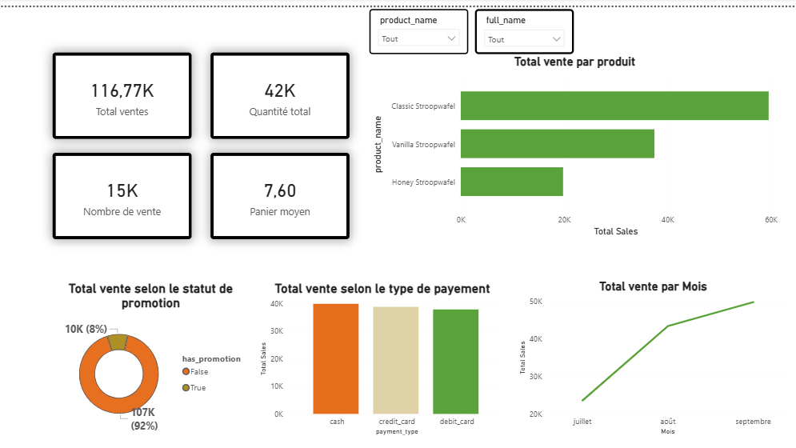

🧁 Stroopwafel Sales Analytics Project

📌 Overview

Ce projet est un pipeline de données complet (end-to-end) permettant d’analyser les performances de ventes d’une entreprise de distribution.

Il simule un environnement réel de Data Engineering avec :

ingestion des données
stockage dans PostgreSQL
transformation avec dbt
modélisation en couche analytics
visualisation dans Power BI

🏗️ Architecture du pipeline
CSV Files
   ↓
Python (pandas, SQLAlchemy)
   ↓
PostgreSQL (raw schema)
   ↓
dbt (staging → marts)
   ↓
Data Warehouse (analytics schema)
   ↓
Power BI Dashboard

🧰 Stack technique
Python (pandas, SQLAlchemy)
PostgreSQL
dbt (Data Build Tool)
Power BI
Git / GitHub

🗄️ Modélisation des données

📊 Table de faits
fct_sales : analyse des ventes au niveau ligne de ticket

📦 Dimensions
dim_products : catalogue produits
dim_employees : employés et performance
dim_promotions : analyse des promotions
dim_shifts : planning des employés

🔄 Data Pipeline

1. Ingestion (Python)
Chargement des fichiers CSV
Nettoyage des données
Insertion dans PostgreSQL (schéma raw)

3. Transformation (dbt)
🔹 Staging layer
Standardisation des données
Typage des colonnes
Nettoyage et préparation
🔹 Marts layer
Modèles analytiques (dimensions & facts)
Création de métriques métier
Jointures entre entités
🧪 Data Quality (dbt tests)
not_null constraints
unique constraints
relationships integrity
accepted values validation

✔ Plus de 50 tests exécutés avec succès

📊 Dashboard Power BI

Le dashboard permet de suivre les performances commerciales :

KPI principaux :
Chiffre d’affaires total
Quantité vendue
Produits les plus performants
Performance des employés
Impact des promotions

### Aperçu du dashboard

📈 Business Insights
Identification des produits les plus rentables
Analyse de l’impact des promotions sur les ventes
Suivi des performances des employés
Analyse des tendances de ventes dans le temps
🚀 Installation & exécution
pip install -r requirements.txt
python scripts/load_data.py
dbt run
dbt test
⚠️ Configuration (.env)

Créer un fichier .env :

DB_HOST=localhost
DB_PORT=5432
DB_USER=postgres
DB_PASSWORD=your_password
DB_NAME=stroopwafelshop
📌 Résultat final

✔ Pipeline complet data engineering
✔ Modélisation dbt (staging + marts)
✔ 50+ tests de qualité validés
✔ Dashboard Power BI interactif
✔ Projet versionné sur GitHub

👤 Auteur

Aboubacar Doumbia

ISE | Data Analyst | Data Engineer Junior
📍 Côte d’Ivoire
